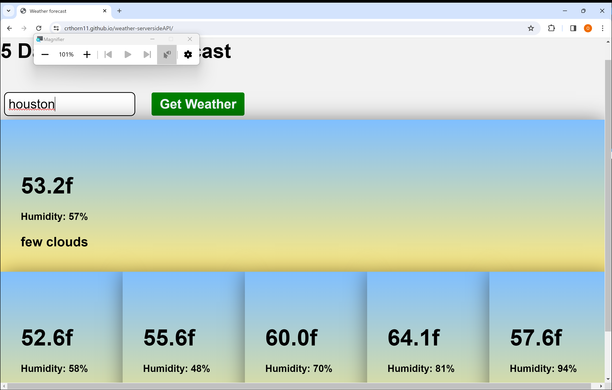

# weather-serversideAPI
My weather application using server side APIs to see the weather for various cities that the user can search for and get a 5 day forecast.

# Link to the deployed application
https://crthorn11.github.io/weather-serversideAPI/

# Link to my guthub
https://github.com/crthorn11/weather-serversideAPI

# Image of deployed application

